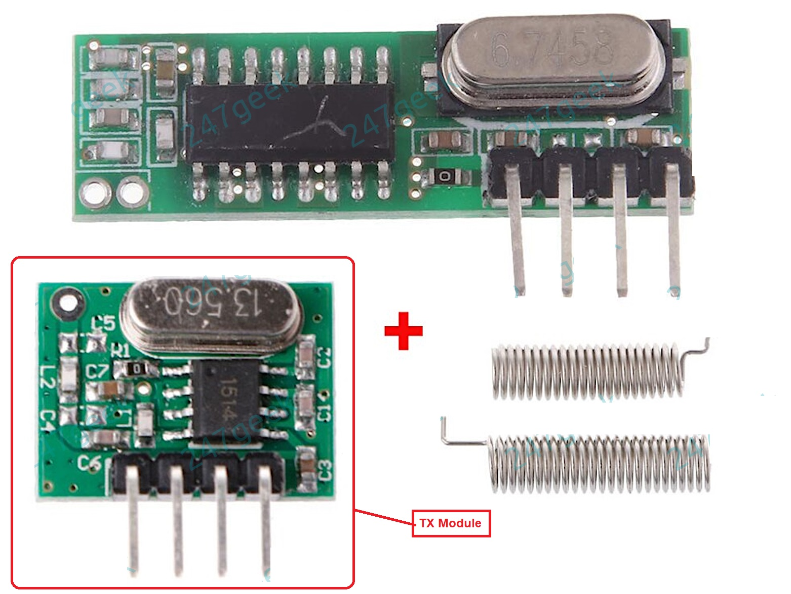

# IQ-group-pir-wireless-arduino-TX
Use an arduino UNO and a cheap 433 MhZ TX module to spoof a triggering RF signal that switches the mains switch in an IQ Group mains controller (as pictured below)

using an ardunio Uno and cheap 433mHz TX module (as pictured below) 

To make this work, do the following 
 - PREPARATION
   - Be safe - Power all things down first!!
   - On the Arduino
     - Wire up the 433 mHZ module - Use pin3 for the TX signal   
   - On the receiver:
     - Wire up the output light
     - Wire up mains power

 - CODE RESET (Optional) - Only do this if you want start from scratch
   - On the Receiver 
     - Power it up
     - Press the Receiver's PROGRAM button for 5 seconds
         
 - CODE LEARNING
   - On the Receiver 
     - Power it up
     - Press the Receiver's PROGRAM button for 1-2 seconds (If you press for longer, you may reset all codes - see previous section) The receiver LED will go ON, indicating it is in PROGRAM MODE, and will remain ON for 5 minutes  
   - On the Arduino
     - Power it up - it will start transmitting every 30 seconds
     - Check the receiver LED. If the code has been accepted and stored, the receiver LED will go off and all is done for that sensor.

N.B. It is possible for the reciever to recognise more than one code - You would just press the Receiver PROGRAM button again for 1-2 seconds, and then transmit from the other device. However, bear in mind it is not necessary to repeat code learning if all devices use the same code (as seen in the transmit sketch).
