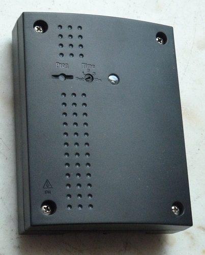
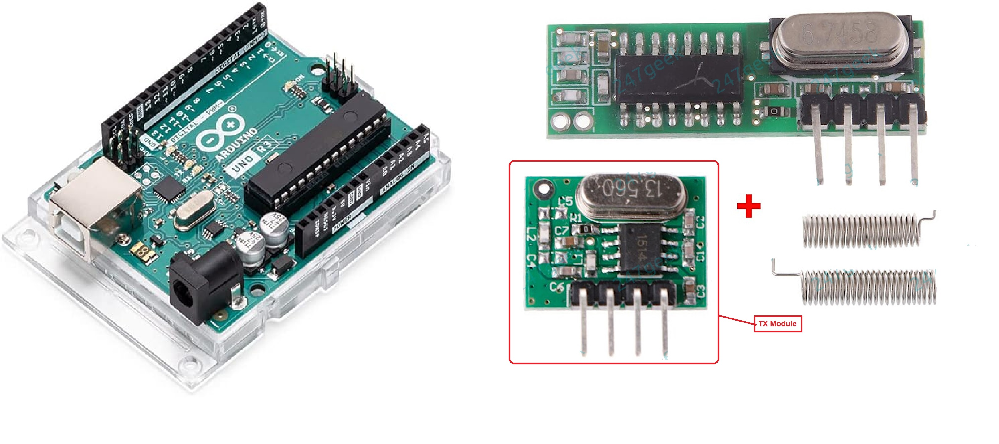

# IQ-group-pir-wireless-arduino-TX
Use an arduino UNO and a cheap 433 MhZ TX module to spoof a triggering RF signal that switches the mains switch in an IQ Group mains controller (as pictured below)

using an ardunio Uno and cheap 433mHz TX module (as pictured below) 

# To make this work, do the following 
 - PREPARATION
   - Be safe - Power all things down first!!
   - On the Arduino
     - Wire up the 433 mHZ module - Use a dupont male to demale wires to link
       - Arduino 5V  to TX Module +V  
       - Arduino 0V  to TX Module ground  
       - Arduino pin 3 (TX signal) to the TX Module input pin  
   - On the receiver:
     - Wire up mains input power
     - Gently turn the duration pot all the way counter clockwise - It is to be set to "Test" - This means that once the receiver is triggered, the receiver relay clicks on for about 5 seconds, and then it clicks off - you can hear it happening.  

 - CODE RESET - Do this if you want start from scratch
   - On the Receiver 
     - Power it up - If codes have already been stored, the LED will light up solid. If there are no codes (e.g. its the very first time it is powered up, and it is empty). The light may start up in "Programming mode" which is indicated by the LED slowly pulsing on and off
     - Wait for about a minute for the receiver internals to settle down
     - Press the Receiver's PROGRAM button for 5 seconds to make sure it resets. The receiver will either do one of the following:
       - Pulse very quickly for a bit (indicating it has emptied code)
       - it doesn't do anything (indicating no code was previously stored) and just continues blinking slowly on and off. 
                
 - CODE LEARNING
   - On the Receiver 
     - Power it up. If it is for the first time, the led will gently pulse on and off.
     - If the LED is on solid, press the Receiver's PROGRAM button for 1-2 seconds until the led starts gently pulsing on and off (If you press for longer, you may reset all codes - see previous section)
   - On the Arduino
     - Power it up - it will start transmitting every 15 seconds. 
   - On the Receiver
     - Check that the LED is now solid. If is is solid, then the code has been stored. If the LED is not solid, then TX signal has not been recognised.
     - Wait until the relay starts clicking. This means that all is setup and working OK. 

N.B. If all is setup and working OK, the relay will click on every 15 seconds, and stay on for about 5 seconds. This will repeat until you stop the Arduino from sending TX signals!

N.B. You will notice that when the relay is on, the LED is flashing slowly. Whenever the relay is off, The LED is solid on.

N.B. You will notice that you can change the "ON" time on the receiver by turning the receiver pot 

N.B. If you ever power cycle the receiver off and on, wait for a bout a minute before trying to do things. It seems the Receiver needs some time to settle down and stabilise before it can work OK 

N.B. It is possible for the receiver to recognise separate codes. However, bear in mind that if all devices use the same sketch TX "code" (as seen in the transmit sketch INO file), you do not need to do it!
