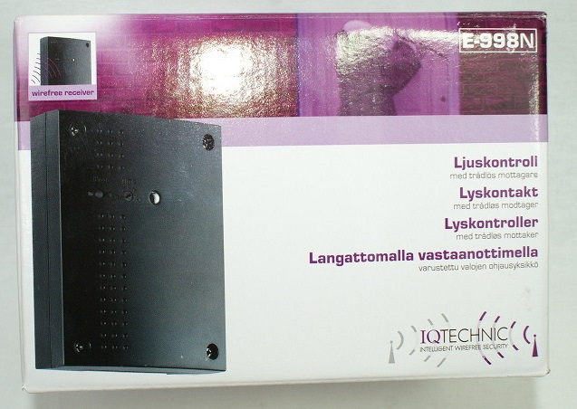

# IQ-group-pir-wireless-arduino-TX
Spoof a PIR message using an arduino UNO and a cheap 433 MhZ TX module, to trigger the mains switch in an IQ Group mains controller that looks like this

and comes in a box like this:

